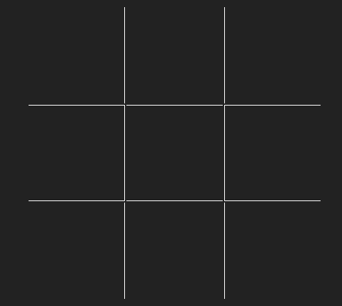
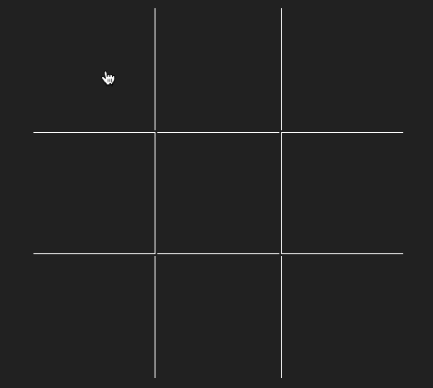
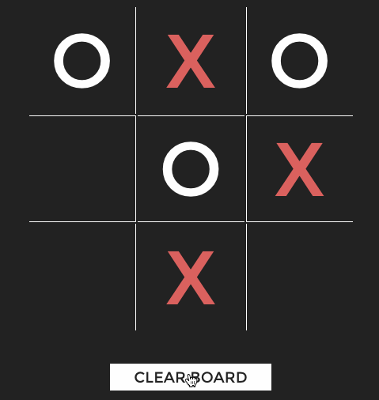
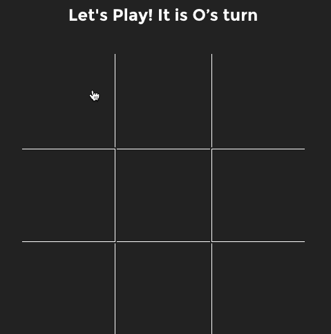
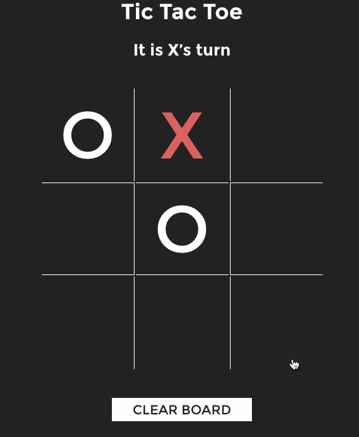
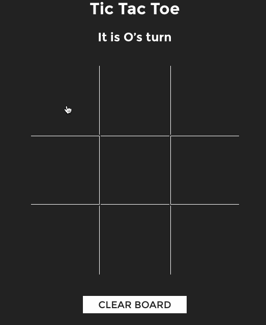

# Week 1 Project - Tic-Tac-Toe

**Objective:** Build a tic-tac-toe game using jQuery.

This week, we learned how we can use jQuery to manipulate the DOM.
This lab will combine those skills with your knowledge of writing functions, working with loops, and writing conditionals.

Are you ready?

## Minimum Requirements
* A user should be able to click on different squares to make a move.
* Every click will alternate between marking an `X` and `O`.
  * HINT #1: You can use the `data-num` attribute that has been provided in your HTML file to figure out which square the user clicked.
  * Google "select element by attribute jQuery" if you're unsure how to do this.
  * HINT #2: You'll want to use the `this` keyword here.
* Upon the marking of an individual cell, use JavaScript to add a class to each cell to display X and O in separate colors.
  * Hint: Classes `player1` and `player2` have been added to the style.css file for you to apply with jQuery.

  	
* A cell should not be able to be replayed once marked.

  
* When the reset button is clicked, the contents of the board should clear.
  

## How to Get Started
1. The HTML and CSS for this project have been provided for you. For an extra challenge, try building the game from scratch by creating an empty project and building a 3x3 grid using HTML/CSS.
2. Getting started with your JavaScript:
  * Write pseudocode that makes the tic-tac-toe game functional.
  * Ensure the document is ready (`$(document).ready`...) in your JS file before you start working with any DOM elements.
	* Locate the element first in order to use it within your app. With jQuery, you can use your CSS-style selectors to locate elements. 
    - Examples: `$('#elementId')` or `$('tagName')`
	* After finding the elements, start writing logic to listen for `click` events on those elements.
    - Example:
      ```js
      $('button').on('click', function () {
        // Code that should run when button is clicked.
      });
      ```
	* You will also need a variable to keep track of moves, as this will be used to indicate whether or not to draw an `X` or an `O`.
    - Hint: Keep track of the number of plays that have been made. You can then use the `%` operator to figure out the appropriate player's turn.

## Bonus Tasks
* Display a message to indicate the appropriate player's turn.

  
* After the necessary moves have been made, stop the game and alert the winner if one player ends up winning three games in a row, or if the board is full and it is a draw. Update the reset button with the text: "Play Again."
  
    * Hint: First, you'll need to create an array for each player (e.g., `player1Moves` and `player2Moves`) to track their moves.
    * Hint: Then you'll need to create a multi-dimensional array `winningCombinations` that contains arrays for each winning combination. For example, if either player has selected the squares numbered 1, 2, and 3, they have won the game.
    * Hint: When a player makes a move, loop over each array within `winningCombinations` and check to see if any of the winning combinations exist in the player's array (Look up the `indexOf()` method).
  	
  	

## Ultra Bonus
* We once had a student implement an Artificial Intelligence (A.I.) opponent. If you really need a challenge, write some code that will play a game of tic-tac-toe against you. (Hint: look into the minimax algorithm).

## Resources
- [jQuery Cheat Sheet](https://oscarotero.com/jquery/)
- [jQuery Events Documentation](https://api.jquery.com/category/events/)
