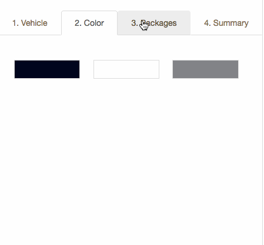
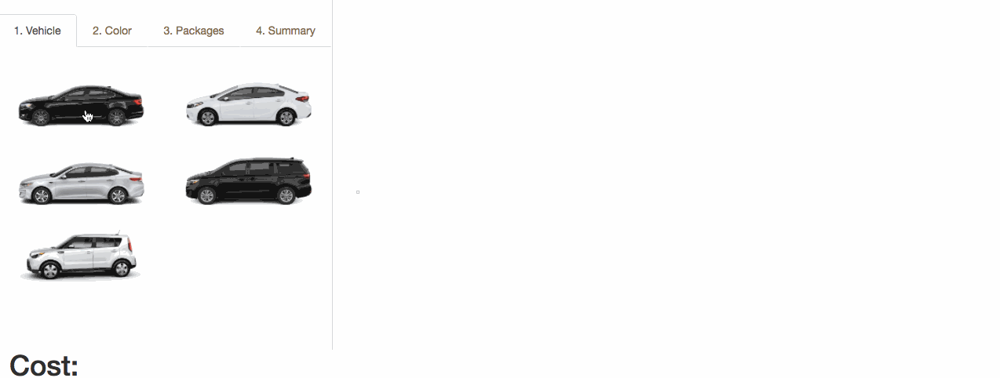

#  Body Shop

##Learning Objectives

- Demonstrate a working knowledge of object properties and methods
- Create objects using constructor notation and instances of those objects using the new keyword.
- Compare and contrast creating objects using literal notation vs. constructor notation.
- Define methods on custom objects by attaching them to the prototype
- Understand object inheritance

## Introduction

> ***Note:*** _This can be a pair programming activity or done independently._

For this project option you will build a website that allows a user to build a car of their choice. The development of this site will heavily focus on DOM manipulation.

## Exercise

#### Starter code

Some basic HTML/CSS along with images for the project have been provided in the `starter-code` folder.

#### Deliverable

##### Step 1:
When a user clicks on one of the steps (i.e. `li` element) a class `.active` should be added to it and removed on any other element that's not clicked on. `.active` will add appropriate styling.

##### Step 2:
There are multiple steps in building a car: choosing a vehicle, color, etc. The first part of development will be to organize the steps so that only its relevant HTML shows. For example, the color swatches should only show on the color step.

> Hint:
When a user clicks on a step, use the data attribute to figure out which step they clicked and use a `switch` statement to display or hide the related content. You can use jQuery's `hide` or `show` to help with this.

##### Step 3:
Create a list of different packages that will be shown as options on _3. Packages_.

> Hint:
Create an array of objects where each object has key/value pairs that define a package. Then, iterate through your array, and append each package to the DOM.

##### Step 4:
As a user chooses the color of the car, make sure to reflect their choice visually by updating the right side of the screen in `.vehicle-display`.

> Hint:
Look at `style.css` to see the various classes you can use which contain background-images of different colored cars.

##### Step 5:
Besides DOM manipulation, this website should also keep track of the price of the vehicle being built, a price that is determined by the different options selected. Associate a different price per option: vehicle, color and package. As a vehicle is being built, the _Cost:_ footer should be updated appropriately. One way to go about this is to create an object per option with key value pairs of option type and price (e.g. `var color = {ruby: 2000}`). There could also be a vehicle object whose properties reflect the options and are dynamically added. To calculate the price you would add all property values.

##### Step 6:
On the _Summary_ tab, detail each cost per option.

## Hungry for More?
- Implement templating using [handlebarsjs](http://handlebarsjs.com/). For example, each step can have its own template.

## Need More Review?
- Videos
	- JS Circuits - Constructor Notation - [Student Directory](https://generalassembly.wistia.com/medias/cjdt6hhkfz)
	- JS Circuits - Objects Past, Present & Future - [Date Object](https://generalassembly.wistia.com/medias/ga9vu35oz6)
	- JS Circuits - [Constructor vs. Literal Notation](https://generalassembly.wistia.com/medias/86ik38eakk)
	- [OOP Intro](https://generalassembly.wistia.com/medias/lahxav6p4z)
	- [OOP Case Study](https://generalassembly.wistia.com/medias/0bgiqqwd68)
	- [OOP Case Study #2](https://generalassembly.wistia.com/medias/lwjshtw79q)
- Readings
	- MDN - [Intro to OOP](https://developer.mozilla.org/en-US/docs/Web/JavaScript/Introduction_to_Object-Oriented_JavaScript)
	- [Object Oriented Analysis and Design with Applications, by Grady Booch and others](http://www.goodreads.com/book/show/424923.Object_Oriented_Analysis_and_Design_with_Applications)
	- [Great lecture notes](https://atomicobject.com/resources/oo-programming/introduction-motivation-for-oo)
	- [OOP in JS from JavascriptIsSexy](http://javascriptissexy.com/oop-in-javascript-what-you-need-to-know/)
	- [Javascript, The Good Parts](http://www.goodreads.com/book/show/2998152-javascript)
	- [Practical Object Oriented Design in Ruby, by Sandi Metz](http://www.poodr.com/)

